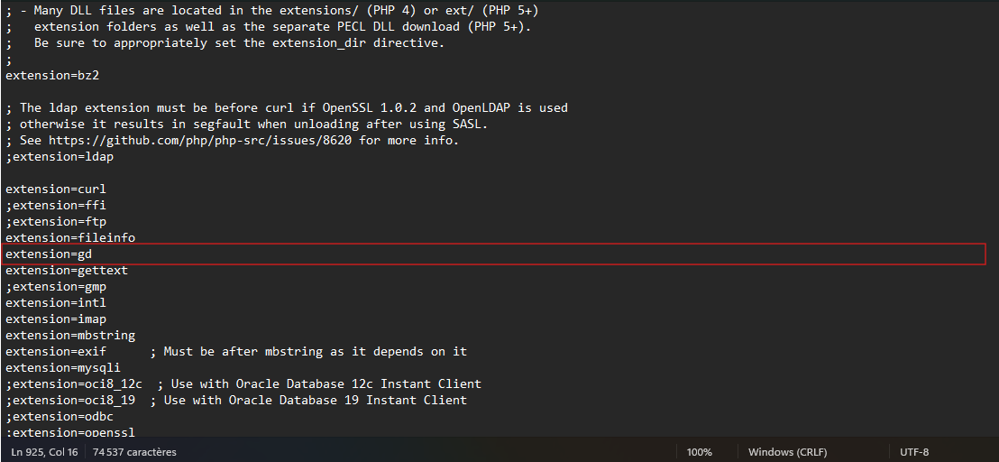
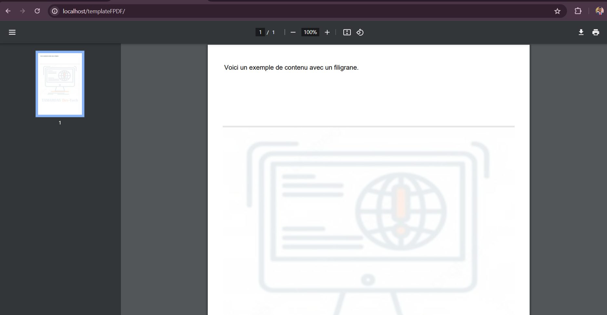

# TEMPLATE FPDF + GD
## Template of generation PDF file with FPDF and GD

Initialization

* Download the FPDF library from the site http://www.fpdf.org/
* the GD library is already integrated into PHP, just make sure the extension is enabled in php.ini.  in this template, there's a condition that checks whether the extension is enabled.

 Activation simply involves uncommenting the extension line, as in the image below

 ### example
 

Once the GD extension has been activated, restart your web server and you'll be able to view the results.

>> the GD library is used to generate the image you see in watermark. The code is very explicit with the comments 👌🏿😎

